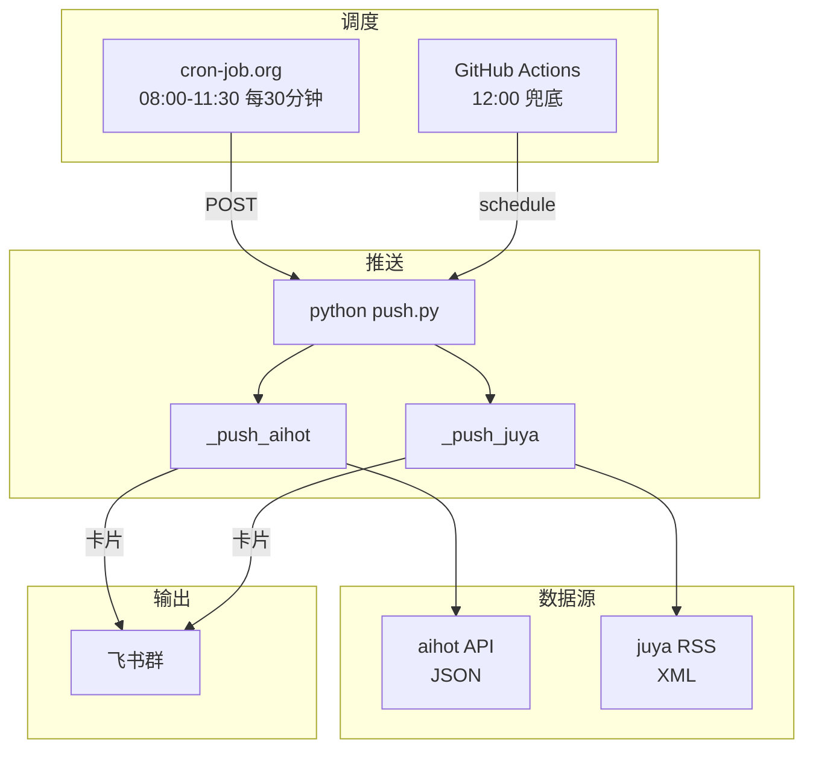

# AI 每日早报推送系统

自动聚合 [橘鸦 AI 早报](https://daily.juya.uk/) 和 [AI HOT](https://aihot.virxact.com/) 两个源的 AI 资讯，解析成飞书卡片，每天上午定时推送到飞书群。

## 它做什么

- 每天上午 8:00-12:30，每 30 分钟检查一次两个源是否有新内容
- juya 有新日报 → 解析 RSS 里的 HTML 概览，渲染成飞书卡片推送
- aihot 有新日报 → 解析 JSON API，渲染成飞书卡片推送
- 两个源独立去重，当天推过就不再重复
- 解析失败自动降级，11:00 后仍失败则发带链接的文本兜底
- 连续 3 次失败或 3 天没更新 → 自动告警到运维群

## 效果

飞书群每天上午收到 2 条卡片消息：

### 橘鸦 AI 早报


### AI HOT 日报


## 快速部署

把下面这段话发给你的 AI 助手，它会一步步带你完成：

> 帮我部署一个 AI 每日早报推送系统。
> 仓库地址：https://github.com/<你的用户名>/design-team-ai-daily
> 我已经 Fork 了这个仓库。
> 请按照 README 里的 "部署引导" 一步步带我完成。

### 部署引导（给 AI 助手的指令）

**第 1 步：确认仓库已 Fork**
- 用户应该已经 Fork 了仓库。如果还没，先让他 Fork。

**第 2 步：创建飞书自定义机器人**
- 让用户打开飞书，进入一个群
- 群设置 → 群机器人 → 添加机器人 → 自定义机器人
- 勾选"签名校验"
- 拿到：webhook URL（类似 `https://open.feishu.cn/open-apis/bot/v2/hook/xxxxx`）和签名 secret
- **提醒用户：这两个信息不要截图发到群里**

**第 3 步：设置 GitHub Secrets**
- 打开 Fork 后的仓库 → Settings → Secrets and variables → Actions
- 点 "New repository secret"，依次添加 4 个：

| Secret 名称 | 值 |
|---|---|
| `LARK_WEBHOOK_URL` | 飞书机器人的 webhook URL |
| `LARK_WEBHOOK_SECRET` | 签名 secret |
| `LARK_OPS_WEBHOOK_URL` | 和上面同一个 URL（单群模式） |
| `LARK_OPS_WEBHOOK_SECRET` | 和上面同一个 secret（单群模式） |

**第 4 步：生成 GitHub PAT**
- 打开 https://github.com/settings/tokens
- 点 "Generate new token (classic)"
- 名字填 `cron-job-daily-news`
- 只勾选 `workflow` 权限
- 有效期建议 90 天
- 生成后复制 token（只显示一次）

**第 5 步：配置 cron-job.org**
- 打开 https://cron-job.org → 注册/登录
- 点 "Create cronjob"
- **Title**: `ai-news-daily-push`
- **URL**: `https://api.github.com/repos/<你的用户名>/design-team-ai-daily/actions/workflows/daily-ai-news.yml/dispatches`
- **Method**: `POST`
- **Headers**:
  - `Authorization: Bearer <刚才复制的 GitHub PAT>`
  - `Accept: application/vnd.github.v3+json`
  - `Content-Type: application/json`
- **Body**: `{"ref":"master","inputs":{"target_date":""}}`
- **Execution time / Timezone**: `Asia/Shanghai`
- **Schedule**: Crontab 填 `*/30 8-12 * * *`
- 点 "TEST RUN" → 返回 204 就是成功
- 点 "CREATE"

**第 6 步：验证**
- 打开仓库 → Actions → `daily-ai-news-push`
- 点 "Run workflow" → 留空 → "Run workflow"
- 等 30-60 秒，看飞书群是否收到卡片
- 如果 juya 今天还没发，日志会显示 `[skip] not updated`，这是正常的
- 如果收到卡片 → 部署成功

**第 7 步：确认明天能自动推送**
- 告诉用户：明天上午 8:00 开始，每 30 分钟会自动检查
- 如果 juya 发布了新日报，会在 30 分钟内推送到飞书群

### 常见问题（部署时）

| 问题 | 原因 | 解决 |
|---|---|---|
| TEST RUN 返回 404 | URL 里的用户名或仓库名填错了 | 检查 `<你的用户名>` 和仓库名 |
| TEST RUN 返回 401/403 | PAT 权限不够或已过期 | 重新生成 PAT，只勾 `workflow` |
| Run workflow 后飞书没收到 | Secrets 填错了 | 检查 4 个 Secrets 的值 |
| 日志显示 `[skip] not updated` | juya 今天还没发 | 正常，等 juya 发布后会自动推 |
| 收到的是纯文本不是卡片 | 卡片解析失败 | 检查 juya RSS 格式是否变了 |

## 项目结构

```
push.py          # 主入口：先推 aihot，再推 juya
rss.py           # juya RSS 抓取 + 当天条目提取
aihot.py         # aihot JSON API 拉取
lark.py          # 飞书 webhook 签名 + POST
lark_card.py     # juya 卡片渲染（HTML → 飞书卡片）
aihot_card.py    # aihot 卡片渲染（JSON → 飞书卡片）
state.py         # 推送状态管理（去重、失败计数、停更告警）
state.json       # 运行状态（workflow 自动 commit）
tests/           # 88 个测试
.github/workflows/daily-ai-news.yml  # GitHub Actions 调度
```

## 工作流程



## 本地开发

```bash
pip install -r requirements.txt
pytest -v                    # 88 个测试，应全绿

# 本地跑一次推送：
export LARK_WEBHOOK_URL="你的URL"
export LARK_WEBHOOK_SECRET="你的secret"
export LARK_OPS_WEBHOOK_URL="同上"
export LARK_OPS_WEBHOOK_SECRET="同上"
python push.py
```

## 容错机制

| 场景 | 行为 |
|---|---|
| 源头还没发今天的 | skip，等下一个 cron |
| 卡片解析失败（11:00 前） | 不标记已推送，运维群告警，等下一个 cron 重试 |
| 卡片解析失败（11:00 后） | 发带链接的文本到主群（最终兜底） |
| 连续 3 次拉取失败 | 运维群告警，重置计数 |
| 连续 3 天没更新 | 运维群告警"停更" |
| 飞书 webhook 失效 | 连续 3 次失败后告警 |

## 外部依赖

| 依赖 | 用途 |
|---|---|
| `daily.juya.uk` | juya AI 早报 RSS |
| `aihot.virxact.com` | aihot 日报 JSON API |
| GitHub Actions | 调度 + 执行 |
| 飞书开放平台 | 推送通道 |

## License

MIT
