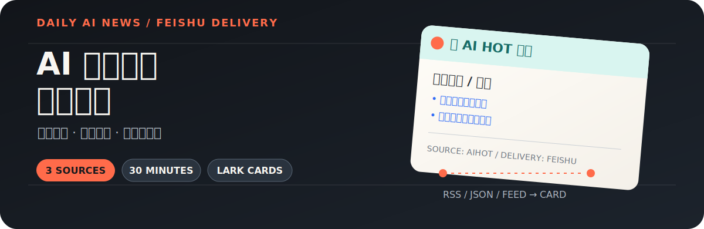
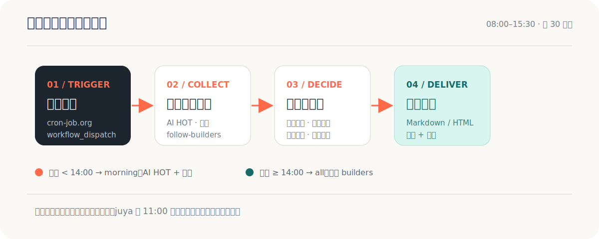

<p align="center">
  
</p>

<p align="center">
  <a href="https://github.com/Ai-luren/Ainews-to-Feishu/actions/workflows/daily-ai-news.yml"></a>
  <a href="https://github.com/Ai-luren/Ainews-to-Feishu/blob/master/LICENSE"></a>
  <a href="https://www.python.org/"></a>
</p>

每天把分散在 AI HOT、橘鸦 AI 早报和 follow-builders 的资讯，整理成适合阅读的飞书卡片，按时推送到群聊。

它更像一条小型的“早报生产线”：外部定时器负责叫醒 GitHub Actions，程序负责拉取、解析、路由、去重和容错，最后把结果交给飞书。

## 先看效果

下面是仓库实际生成的飞书卡片，而不是概念图：

<p align="center">
  
  
</p>

### 三个来源，一条消息流

| 来源 | 输入 | 输出 |
| --- | --- | --- |
| [橘鸦 AI 早报](https://daily.juya.uk/) | RSS / HTML 概览 | 中文资讯卡片 |
| [AI HOT](https://aihot.virxact.com/) | JSON API | 日报卡片 |
| [follow-builders](https://github.com/zarazhangrui/follow-builders) | GitHub JSON feed | 中英双语动态卡片 |

## 它解决什么问题

- **定时聚合**：每天 08:00–15:30，每 30 分钟触发一次。
- **按时段路由**：14:00 前先推 AI HOT + 橘鸦；14:00 后补推 builders。
- **独立去重**：三个来源分别记录推送状态，已推内容不会重复发送。
- **失败可恢复**：juya 内容解析失败会告警并重试，11:00 后仍失败则降级发送带链接的文本。
- **持续告警**：连续 3 次失败或连续 3 天没有更新时，通知运维群。

## 工作流程

<p align="center">
  
</p>

GitHub Actions 只负责执行 `workflow_dispatch`，不包含内部 `schedule`。外部调度由 cron-job.org 负责，避免把调度时间和代码仓库绑死。

## 部署

这是一个 Fork 后即可运行的 GitHub Actions 项目。部署时只需要准备飞书机器人、GitHub Secrets 和一个外部定时任务。

### 1. Fork 仓库

先 Fork 本仓库，并在后续步骤中使用你自己的仓库地址：

```text
https://github.com/<你的用户名>/Ainews-to-Feishu
```

### 2. 创建飞书自定义机器人

在目标飞书群中打开：

```text
群设置 → 群机器人 → 添加机器人 → 自定义机器人
```

开启签名校验，保存以下两项：

- `webhook URL`
- `签名 secret`

不要把这两个值截图或提交到仓库。

### 3. 添加 GitHub Secrets

打开 Fork 后的仓库：`Settings → Secrets and variables → Actions → New repository secret`。

| Secret | 值 |
| --- | --- |
| `LARK_WEBHOOK_URL` | 飞书机器人的 webhook URL |
| `LARK_WEBHOOK_SECRET` | 飞书签名 secret |
| `LARK_OPS_WEBHOOK_URL` | 运维群 webhook；单群模式可填同一个 URL |
| `LARK_OPS_WEBHOOK_SECRET` | 运维群签名 secret；单群模式可填同一个 secret |

### 4. 创建 GitHub PAT

在 [GitHub token 设置](https://github.com/settings/tokens) 创建 classic token：

- 名称：`cron-job-daily-news`
- 权限：只勾选 `workflow`
- 有效期：建议 90 天

Token 只显示一次，请立即保存。它只用于让 cron-job.org 调用 GitHub 的 workflow dispatch API。

### 5. 配置 cron-job.org

创建一个 cronjob，配置如下：

| 项目 | 值 |
| --- | --- |
| Title | `ai-news-daily-push` |
| URL | `https://api.github.com/repos/<你的用户名>/Ainews-to-Feishu/actions/workflows/daily-ai-news.yml/dispatches` |
| Method | `POST` |
| Timezone | `Asia/Shanghai` |
| Schedule | `*/30 8-15 * * *` |

请求 Headers：

```text
Authorization: Bearer <你的 GitHub PAT>
Accept: application/vnd.github.v3+json
Content-Type: application/json
```

请求 Body：

```json
{"ref":"master","inputs":{"target_date":"","push_mode":"all"}}
```

点击 `TEST RUN`，返回 `204` 即表示 GitHub 已接收触发请求。

### 6. 首次验证

1. 打开仓库的 `Actions` 页面。
2. 选择 `daily-ai-news-push`，点击 `Run workflow`。
3. `target_date` 留空，`push_mode` 选择 `all`。
4. 等待 30–60 秒，确认飞书群收到卡片。

juya 如果当天还没有发布，日志出现 `[skip] not updated` 属于正常情况。

## 本地开发

```bash
python3 -m venv .venv
source .venv/bin/activate
pip install -r requirements.txt
pytest -v
```

本地真实推送前，先设置四个环境变量；不要把它们写进代码或提交到 Git：

```bash
export LARK_WEBHOOK_URL="你的 URL"
export LARK_WEBHOOK_SECRET="你的 secret"
export LARK_OPS_WEBHOOK_URL="运维群 URL"
export LARK_OPS_WEBHOOK_SECRET="运维群 secret"
python push.py
```

## 项目结构

```text
push.py                     # 主入口：按 PUSH_MODE 分流推送
rss.py                      # 橘鸦 RSS 抓取与当天条目提取
aihot.py                    # AI HOT JSON API 拉取
builders.py                 # follow-builders feed 拉取与翻译
lark.py                     # 飞书 webhook 签名、POST、限流重试
*_card.py                   # 三类资讯的飞书卡片渲染
state.py                    # 去重、失败计数、停更告警
.github/workflows/          # workflow_dispatch 执行流
tests/                      # pytest 测试套件
assets/                     # 卡片截图与 README 视觉素材
```

## 常见问题

| 现象 | 优先检查 |
| --- | --- |
| TEST RUN 返回 404 | URL 中的用户名、仓库名或 workflow 文件名 |
| TEST RUN 返回 401/403 | PAT 是否过期，是否只授予了 `workflow` 权限 |
| workflow 成功但飞书没消息 | 4 个 Secrets 是否完整、是否复制了错误的 webhook |
| 日志显示 `[skip] not updated` | 来源当天还没有发布新内容 |
| 收到纯文本而非卡片 | juya RSS 的 HTML 结构是否发生变化 |
| `frequency limited` | 飞书 webhook 频率限制；程序内置等待和重试 |

## 外部依赖

- [GitHub Actions](https://github.com/features/actions)：运行测试和推送任务
- [cron-job.org](https://cron-job.org/)：每 30 分钟触发 workflow
- [飞书开放平台](https://open.feishu.cn/)：接收卡片消息
- [Google Translate](https://translate.googleapis.com/)：builders 英文内容翻译

## License

[MIT](LICENSE) © 2026 Ai路人
