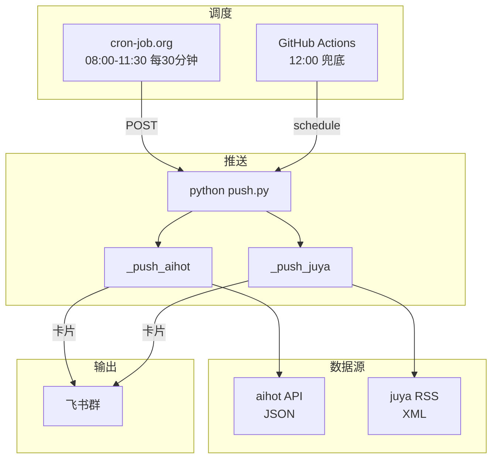

# AI 每日早报推送系统

自动聚合 [橘鸦 AI 早报](https://daily.juya.uk/) 和 [AI HOT](https://aihot.virxact.com/) 两个源的 AI 资讯，解析成飞书卡片，每天上午定时推送到飞书群。

## 它做什么

- 每天上午 8:00-11:30，每 30 分钟检查一次两个源是否有新内容
- juya 有新日报 → 解析 RSS 里的 HTML 概览，渲染成飞书卡片推送
- aihot 有新日报 → 解析 JSON API，渲染成飞书卡片推送
- 两个源独立去重，当天推过就不再重复
- 解析失败自动降级，11:00 后仍失败则发带链接的文本兜底
- 连续 3 次失败或 3 天没更新 → 自动告警到运维群

## 效果

飞书群每天上午收到 2 条卡片消息：

```
🤖 橘鸦 AI 早报 · 2026-06-21
  要闻
  • Codex 宣布支持本地与远程主机间交接会话 ↗
  • Anthropic 修复 Claude Code 额度异常 bug ↗
  ...
  [📖 查看完整日报] [🎬 B站]

🔥 AI HOT 日报 · 2026-06-21（15 条）
  大模型
  • GPT-5 发布 ...
  ...
  [📖 查看完整日报]
```

## 快速部署

### 1. Fork 这个仓库

### 2. 在飞书群里建自定义机器人

群设置 → 群机器人 → 添加机器人 → **自定义机器人** → 勾选**签名校验**

拿到 webhook URL 和签名 secret。

### 3. 设置 GitHub Secrets

仓库 Settings → Secrets and variables → Actions → New repository secret，添加 4 个：

| Secret 名称 | 值 |
|---|---|
| `LARK_WEBHOOK_URL` | 飞书机器人 webhook URL |
| `LARK_WEBHOOK_SECRET` | 签名 secret |
| `LARK_OPS_WEBHOOK_URL` | 运维告警 webhook（可以和上面同一个）|
| `LARK_OPS_WEBHOOK_SECRET` | 运维告警 secret（可以和上面同一个）|

### 4. 设置定时调度（二选一）

**方案 A：cron-job.org（推荐，准时）**

1. 去 [cron-job.org](https://cron-job.org) 注册，创建 cronjob
2. URL 填：`https://api.github.com/repos/<你的用户名>/design-team-ai-daily/actions/workflows/daily-ai-news.yml/dispatches`
3. Method: `POST`
4. Headers: `Authorization: Bearer <你的GitHub PAT>` / `Accept: application/vnd.github+json` / `Content-Type: application/json`
5. Body: `{"ref":"master","inputs":{"target_date":""}}`
6. 时区: `Asia/Shanghai`
7. Crontab: `*/30 8-11 * * *`（北京时间 8:00-11:30，每 30 分钟）

**方案 B：只用 GitHub Actions（简单，但可能延迟 1-2 小时）**

仓库已经配好了 `schedule`，北京时间 12:00 兜底跑一次。如果 juya 在上午发布，这个时间够用。

### 5. 验证

GitHub → Actions → `daily-ai-news-push` → Run workflow → 留空 → 看飞书群是否收到卡片。

## 项目结构

```
push.py          # 主入口：先推 aihot，再推 juya
rss.py           # juya RSS 抓取 + 当天条目提取
aihot.py         # aihot JSON API 拉取
lark.py          # 飞书 webhook 签名 + POST
lark_card.py     # juya 卡片渲染（HTML → 飞书卡片）
aihot_card.py    # aihot 卡片渲染（JSON → 飞书卡片）
state.py         # 推送状态管理（去重、失败计数、停更告警）
state.json       # 运行状态（workflow 自动 commit）
tests/           # 88 个测试
.github/workflows/daily-ai-news.yml  # GitHub Actions 调度
```

## 工作流程



## 本地开发

```bash
pip install -r requirements.txt
pytest -v                    # 88 个测试，应全绿

# 本地跑一次推送：
export LARK_WEBHOOK_URL="你的URL"
export LARK_WEBHOOK_SECRET="你的secret"
export LARK_OPS_WEBHOOK_URL="同上"
export LARK_OPS_WEBHOOK_SECRET="同上"
python push.py
```

## 容错机制

| 场景 | 行为 |
|---|---|
| 源头还没发今天的 | skip，等下一个 cron |
| 卡片解析失败（11:00 前） | 不标记已推送，运维群告警，等下一个 cron 重试 |
| 卡片解析失败（11:00 后） | 发带链接的文本到主群（最终兜底） |
| 连续 3 次拉取失败 | 运维群告警，重置计数 |
| 连续 3 天没更新 | 运维群告警"停更" |
| 飞书 webhook 失效 | 连续 3 次失败后告警 |

## 外部依赖

| 依赖 | 用途 |
|---|---|
| `daily.juya.uk` | juya AI 早报 RSS |
| `aihot.virxact.com` | aihot 日报 JSON API |
| GitHub Actions | 调度 + 执行 |
| 飞书开放平台 | 推送通道 |

## License

MIT
